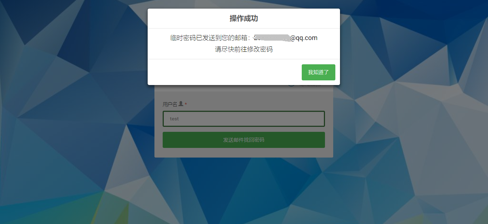

# biaodanjun
### 暑假花了近两周时间实现了期末前的一个想法：做一个在线设计表单、采集信息并能导出结果的工具。用的是SpringBoot + MyBatis + JQuery + Bootstrap，前后台每个细节都一个人忙活还蛮累的，不过很充实，把点子一步步变成现实真的好开森。希望自己再接再厉吧o(*￣▽￣*)ブ
### 下面介绍一下项目emmm
### 首页

### 登录界面

### 注册界面

### 登录后可以设计表单，第一步是填写表单基本信息

### 第二步是添加表单项，包括表单项名和填写提示语

### 发布表单后生成填写链接

### 访问填写链接需要之前设定的表单密码

### 填写者输入正确密码进入表单页面进行填写

### 填写成功提示

### 用户登录后可以进入我的表单页面管理自己发布的表单

### 可以进一步查看各表单收到的反馈情况，反馈分为待处理和已处理反馈，查看过的反馈视为已处理

### 查看反馈可以看到填写情况

### 发布者可以选择导出表单收集情况的Excel

### 当表单收集结束时，发布者会收到系统发送的邮件提醒，并会在邮件中附带上表单导出的Excel

### 在非登录状态可以搜索表单，进行填写，可以按表单名称或发布者模糊搜索

### 可以修改密码

### 忘记密码时可用邮箱找回

